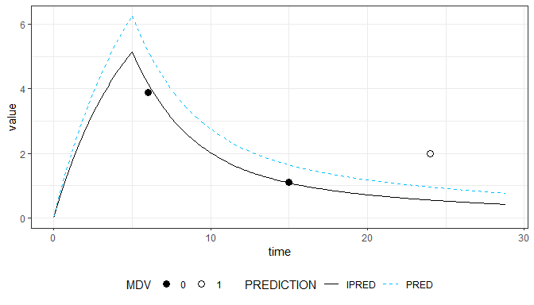
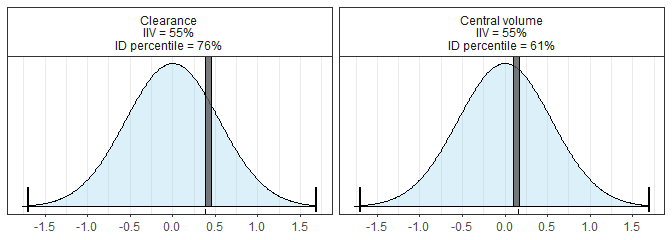

<!-- README.md is generated from README.Rmd. Please edit that file -->

# mapbayr 

<!-- badges: start -->

[](https://CRAN.R-project.org/package=mapbayr)
<!-- badges: end -->

mapbayr is a free and open source package for *maximum a posteriori*
bayesian estimation in R. Thanks to a single function, `mbrest()`, you
can estimate individual PK parameters from:

  - a population PK model coded in *mrgsolve*,
  - a data set of concentrations to fit (NM-TRAN format).

It was designed to be easily wrapped in [shiny
apps](https://shiny.rstudio.com/) in order to ease model-based
therapeutic drug monitoring, also referred to as Model-Informed
Prediction Dosing (MIPD).

## Installation

mapbayr is not (yet) available on CRAN. You can install it from github
by executing the following code in R console.

``` r
install.packages("devtools")
devtools::install_github("FelicienLL/mapbayr")
```

mapbayr relies on
[mrgsolve](https://github.com/metrumresearchgroup/mrgsolve) for model
implementation and ordinary differential equation solving which requires
C++ compilers. If you are a Windows user, you would probably need to
install Rtools. Please refer to the [installation
guide](https://github.com/metrumresearchgroup/mrgsolve/wiki/mrgsolve-Installation)
of mrgsolve for additional information.

## Example

``` r
library(mapbayr)
library(mrgsolve)
```

#### 1\) Properly code you model

``` r
code <- "
$PARAM @annotated
TVCL:  0.9 : Clearance
TVV1: 10.0 : Central volume
V2  : 10.0 : Peripheral volume of distribution
Q   :  1.0 : Intercompartmental clearance

ETA1: 0 : Clearance (L/h)
ETA2: 0 : Central volume (L)

$OMEGA 0.3 0.3
$SIGMA
0.05 // proportional
0.1 // additive

$CMT @annotated
CENT  : Central compartment (mg/L)[ADM, OBS]
PERIPH: Peripheral compartment ()

$TABLE
double DV = (CENT/V1) *(1 + EPS(1)) + EPS(2);

$MAIN
double CL = TVCL * exp(ETA1 + ETA(1)) ;
double V1 = TVV1 * exp(ETA2 + ETA(2)) ;
double K12 = Q / V1  ;
double K21 = Q / V2  ;
double K10 = CL / V1 ;

$ODE
dxdt_CENT   =  K21 * PERIPH - (K10 + K12) * CENT ;
dxdt_PERIPH =  K12 * CENT - K21 * PERIPH ;

$CAPTURE DV
"


my_model <- mcode("Example_model", code)
```

#### 2\) Bring your dataset

``` r
my_data <- data.frame(ID = 1, time = c(0,6,15,24), evid = c(1, rep(0,3)), cmt = 1, amt = c(100, rep(0,3)), 
                      rate = c(20, rep(0,3)), DV = c(NA, 3.9, 1.1, 2), mdv = c(1,0,0,1))
my_data
#>   ID time evid cmt amt rate  DV mdv
#> 1  1    0    1   1 100   20  NA   1
#> 2  1    6    0   1   0    0 3.9   0
#> 3  1   15    0   1   0    0 1.1   0
#> 4  1   24    0   1   0    0 2.0   1
```

#### 3\) And estimate \!

``` r
est <- mbrest(my_model, data = my_data)
#> 
#> ID 1... done.
```

As building dataset into a NM-TRAN format can be painful, you can use
pipe-friendly `obs_lines()` and `adm_lines()` functions in order to pass
administration and observation information, and perform the estimation
subsequently.

``` r
est <- my_model %>% 
  adm_lines(time = 0, amt = 100, rate = 20) %>% 
  obs_lines(time = 6, DV = 3.9) %>% 
  obs_lines(time = 20, DV = 1.1) %>% 
  obs_lines(time = 24, DV = 2, mdv = 1) %>% 
  mbrest()
```

#### 4\) Then, use the estimations

The results are returned in a single object (“mbrests” S3 class) which
includes input (model and data), output (etas and tables) and internal
arguments passed to the internal algorithm (useful for debugging).
Additional methods are provided, notably to plot the results quickly.

``` r
print(est)
#> Model:  Example_model 
#> ID : 1  individual(s).
#> OBS: 2  observation(s).
#> ETA: 2  parameter(s) to estimate.
#> 
#> Estimates: 
#>   ID      ETA1      ETA2
#> 1  1 0.6367739 0.1377183
#> 
#> Output (4 lines): 
#>   ID time evid cmt amt rate  DV     IPRED     PRED mdv      ETA1      ETA2
#> 1  1    0    1   1 100   20  NA 0.0000000 0.000000   1 0.6367739 0.1377183
#> 2  1    6    0   1   0    0 3.9 4.2896334 5.700008   0 0.6367739 0.1377183
#> 3  1   15    0   1   0    0 1.1 1.1557231 2.210305   0 0.6367739 0.1377183
#> 4  1   24    0   1   0    0 2.0 0.6021212 1.412358   1 0.6367739 0.1377183
```

``` r
plot(est)
```

<!-- -->

``` r
hist(est)  
```

<!-- -->

## Development

mapbayr is under development. Your feedback for additional features
request or bug reporting is welcome. Contact us through the [issue
tracker](https://github.com/FelicienLL/mapbayr/issues).

## Features

mapbayr is a generalization of the “MAP Bayes estimation” tutorial
available on the [mrgsolve
blog](https://mrgsolve.github.io/blog/map_bayes.html). Additional
features are:

  - a unique function to perform the estimation: `mbrest()`.
  - handles multiple error models such as additive, proportional, mixed
    or exponential error (without prior log-transformation of data).
  - fit multiple patients stored in a single dataset.
  - fit both parent drug and metabolite simultaneously.
  - accepts any kind of models thanks to the flexibility of mrgsolve.
  - functions to easily pass administration and observation information,
    as well as plot methods to visualize predictions and parameter
    distribution.
  - a single output object to ease post-processing, depending on the
    purpose of the estimation.
  - several optimization algorithm available, such as “L-BFGS-B” (the
    default) or “newuoa”.

## Performance

Performance, in terms of quality of parameter predictions, was validated
against NONMEM for a wide variety of models and data. However
predictions might differ depending on the complexity of the user’s data
or model, or as function of the number of parameter to estimate. The
user is invited to investigate if discrepancies come from the prediction
of the concentrations (i.e. mrgsolve) or from the optimization process
*per se* (i.e. mapbayr). Feel free to contact us through the [issue
tracker](https://github.com/FelicienLL/mapbayr/issues).

## *mrgsolve* model specification

mapbayr contains a library of example model files (.cpp), accessible
with `mbrlib()`

``` r
my_model <- mread("ex_mbr1.cpp", mbrlib())
```

The user is invited to perform map-bayesian estimation with his/her own
mrgsolve models. These model files should be slightly modified in order
to be “read” by mapbayr with the subsequent specifications :

### 1\. `$PARAM` block

#### 1.1 ETA specifications

  - Mandatory:
      - Add as many ETA as there are parameters to estimate (i.e. the
        length of the OMEGA matrix diagonal).
      - Name them as ETAn (n being the N° of ETA).
      - Set 0 as default value.
  - Strongly recommended:
      - Provide a description as a plain text

<!-- end list -->

``` c
$PARAM @annotated
ETA1 : 0 : CL (L/h)
ETA2 : 0 : VC (L)
ETA3 : 0 : F ()
//do not write ETA(1)
//do not write iETA
```

#### 1.2 Covariates

  - Strongly recommended :
      - Use a `@covariates` tag to record covariates in the `$PARAM`
        block.
      - Set the reference value.
      - Provide a description as a plain text
      - Provide units in parentheses (or a description of 0/1 coding for
        categorical covariates)

<!-- end list -->

``` c
$PARAM @annotated @covariates
BW : 70 : Body weight (kg)
SEX : 0 : Sex (0=Male, 1=Female)
```

### 2\. `$CMT` block

  - Strongly recommanded…  
    … yet **mandatory** if you use `obs_lines()` and `adm_lines()` to
    build your dataset, or if you have multiple types of DV, i.e. parent
    drug + metabolite:
      - A `@annotated` tag must be used to record compartments.
      - Write OBS in brackets to define the observation compartment(s).
        Also used by `obs_lines()` to build your dataset.
      - Write ADM in brackets to define “default” administration
        compartment(s). This information is not used for optimization
        process and the `mbrest()` function. The information is
        mandatory if you use `adm_lines()` to build your dataset in
        order to automatically set the value of the ‘cmt’ column.
        Especially useful if you use a model with an absorption from
        several depot compartment requiring to duplicate administrations
        lines in the data set.

<!-- end list -->

``` c
//example: model with dual zero and first order absorption in compartment 1 & 2, respectively, and observation of parent drug + metabolite 
$CMT @annotated
DEPOT: Depot [ADM]
CENT_PAR: examplinib central [ADM, OBS]
PERIPH : examplinib peripheral
CENT_MET : methylexamplinib central [OBS] 
```

### 3\. `$OMEGA` block

  - Mandatory:
      - The length of the omega matrix must be the same as the number of
        ETAn provided in `$PARAM`.
      - The order of the omega values must correspond to the order of
        the ETAs provided in `$PARAM`. This cannot be checked by mapbayr
        \!

<!-- end list -->

``` c
$OMEGA
0.123 0.456 0.789
$OMEGA @block
0.111 
0.222 0.333
// reminder: omega values can be recorded in multiple $OMEGA blocks
```

### 4\. `$SIGMA` block

The definition of the `$SIGMA` block may not be as straightforward as
other blocks, but we tried to keep it as simple as possible. Keep in
mind that mapbayr always expect a **pair of sigma values** for each type
of dependent variable: the **first** value for proportional error, the
**second** for additive.

Two situations can be distinguished:

1.  You only have one type of concentration to fit, and you did not use
    the \[OBS\] assignment in `$CMT`.

Simply write **one pair** of sigma values to describe proportional and
additive error on your concentrations. This error model will be
automatically applied to the compartment where observations were
recorded in your dataset (i.e. value of CMT when MDV = 0).

``` c
$SIGMA 0.111 0 // proportional error 
```

``` c
$SIGMA 0 0.222 // (log) additive error
```

``` c
$SIGMA 0.333 0.444 // mixed error
```

2.  You have multiple DV to fit (parent and metabolite), and/or you used
    the \[OBS\] assignment in `$CMT`.

Write as many **pairs of sigma values** as there are compartments
assigned with \[OBS\] in `$CMT`. The order of the pair must respect the
order in which compartments were assigned. To put it more clearly, the
sigma matrix will be interpreted as such whatever the model :

| N° in the SIGMA matrix diagonal |                      Associated error                      |
| :-----------------------------: | :--------------------------------------------------------: |
|                1                | Proportional on concentrations in the 1st cmt with \[OBS\] |
|                2                |   Additive on concentrations in the 1st cmt with \[OBS\]   |
|                3                | Proportional on concentrations in the 2nd cmt with \[OBS\] |
|                4                |   Additive on concentrations in the 2nd cmt with \[OBS\]   |

``` c
//example: correlated proportional error between parent and metabolite
$SIGMA @block
0.050 // proportional error on parent drug
0.000 0.000 // additive error on parent drug
0.100 0.000 0.200 // proportional error on metabolite
0.000 0.000 0.000 0.000 // additive error on metabolite
// reminder: sigma values can be recorded in multiple $SIGMA blocks
```

### 6\. `$TABLE` block or `$ERROR` block

  - Mandatory:
      - Refer the concentration variable to fit as `DV`. Mind the code,
        especially if concentrations are observed in multiple
        compartments.
      - Express log-additive error models as exponential. This way,
        concentrations will automatically log-transformed during the
        optimization process, with no necessity to prior log-transform
        your concentration.

<!-- end list -->

``` c
$TABLE
double DV  = (CENTRAL / VC) * exp(EPS(2)) ;
```

  - For fitting parent drug and metabolite simultaneously, refer to them
    as PAR and MET, and define DV accordingly (only DV will be used
    during the optimization process, but PAR and MET variables are
    mandatory for post-processing internal functions)

<!-- end list -->

``` c
$TABLE
double PAR = (CENT_PAR / V) * (1 + EPS(1)) ;
double MET = (CENT_MET / V) * (1 + EPS(3)) ;
double DV = PAR ;
if(self.cmt == 4) DV = MET ; 
// reminder: use "self.cmt" to internaly refer to a compartment in a mrgsolve model code. 
```

Note that mapbayr does not strictly rely on this `$ERROR` block to
define the residual error internally and compute the objective function
value, but on information passed in the `$SIGMA` block. However, we
strongly advise you to properly code your `$ERROR` block with `EPS(1)`,
`EPS(2)` etc…, if only to use your code as a regular mrgsolve model code
and simulate random effects.

### 7\. `$MAIN` block

  - Mandatory:
      - Double every expression containing ETA information, with ETAn
        (will be used for optimization of parameters) and ETA(n)
        (generated for simulations with random effects like a “regular”
        mrgsolve model)
      - Mind the attribution to the good ETAn and ETA(n) as respect to
        the information you provided in `$PARAM` and `$OMEGA`. This
        cannot be checked by mapbayr \!

<!-- end list -->

``` c
$PK
double CL = TVCL * exp(ETA1 + ETA(1))
```

### 8\. `$CAPTURE` block

  - Mandatory:
      - DV must be captured
      - For models with parent + metabolite, PAR and MET must be
        captured too.

<!-- end list -->

``` c
$CAPTURE DV PAR MET
```
